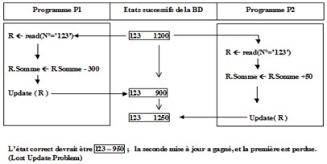
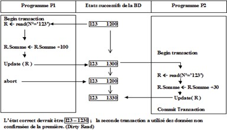
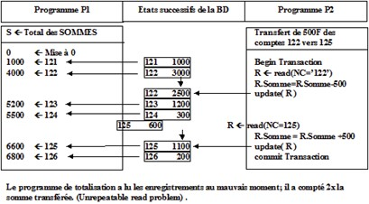

# Questions sur les Bases de Données

## 1) Différences entre fichiers séquentiels (TEXT) et fichiers à accès direct (RANDOM)

| **Caractéristique**            | **Fichier séquentiel (TEXT)** | **Fichier à accès direct (RANDOM)** |
|--------------------------------|-------------------------------|--------------------------------------|
| **Accès**                      | Séquentiel                   | Direct                               |
| **Vitesse d’accès**            | Lent (pour données éloignées) | Rapide                               |
| **Organisation**               | Ordre fixe                   | Indexée ou positionnée               |
| **Usage**                      | Logs, Rapports               | Bases de données, gestion d’enregistrements |
| **Simplicité d’implémentation**| Simple                       | Plus complexe                        |

---

## 2) Organisation des données composites dans un fichier à accès direct (Random)

- **Organisation :**

  - Les données (Nom, Prénom, DateNaissance) sont stockées sous forme d’enregistrements.

  - Chaque enregistrement est identifié par une clé unique (ex : NuméroID).

  - L’adresse de l’enregistrement est calculée ou stockée pour permettre un accès direct, sans parcourir tout le fichier.

- **Rôle d’un fichier d’index :**

  - Associe la clé unique de chaque enregistrement à son adresse dans le fichier.

  - Permet un accès rapide aux données même si elles sont dispersées.

  - Facilite la gestion des ajouts, suppressions ou modifications.

- **Exemple :**

  - **Fichier d’index :** clé 001 → Adresse 1001.

  - **Fichier principal :** Adresse 1001 → Dupont, Pierre, 1999-09-09.

  

---

## 3) Fonctions d'un gestionnaire de bases de données (SGBD)

- **Stockage des données :** organise les données dans des fichiers structurés (tables, index, etc.).

- **Accès aux données :** permet de consulter, modifier, ajouter ou supprimer des données via des requêtes (ex : SQL).

- **Sécurité :** gère les autorisations pour protéger les données contre les accès non autorisés.

- **Intégrité :** assure la cohérence et la validité des données (contraintes d’unicité, clés étrangères, etc.).

- **Sauvegarde et récupération :** protège les données en cas de panne grâce aux sauvegardes régulières et à la restauration.

- **Gestion des transactions :** garantit que les opérations sont réalisées complètement ou annulées en cas d’erreur (propriétés ACID).

- **Partage des données :** permet à plusieurs utilisateurs d’accéder aux données simultanément en gérant les conflits.

---

## 4) Intégrité des données, notion de transaction et propriétés ACID

### **Intégrité des données :**

- **Définition :** Garantit que les données sont correctes, cohérentes et fiables.

- **Exemples :** Une clé primaire doit être unique. Une clé étrangère doit pointer vers une clé primaire valide.

### **Transaction :**

- **Définition :** Ensemble d’opérations formant une unité logique, exécutée complètement ou annulée.

### **Propriétés ACID :**

- **A (Atomicité) :** Tout ou rien.

- **C (Cohérence) :** La base reste valide après une transaction.

- **I (Isolation) :** Les transactions n’interfèrent pas entre elles.

- **D (Durabilité) :** Les changements validés sont permanents.

---

## 5) Déclencheurs (Triggers)

- **Définition :** Action automatique déclenchée par un événement (INSERT, UPDATE, DELETE).

- **Avantages :**

  - **Performance :** Automatisation rapide côté base.

  - **Sécurité :** Valide et protège l’intégrité des données.

---

## 6) Cascade DELETE et Cascade UPDATE

- **Cascade DELETE :**
    - **Explication :** lorsqu'une ligne est supprimée dans une table parent, toutes les lignes liées dans les tables enfants sont automatiquement supprimées.
    - **Intérêt :** maintient la cohérence des données en évitant les références orrphelines.
       
- **Cascade UPDATE :**
    - **Explication :** si une clé primaire dans une table parent est mise à jour, les clés etrangères correspondantes dans les tables enfants sont automatiquement mises à jour.
    - **Intérêt :** Préserve l'integrité des rélations sans besoin d'intervention manuelle. 

---

## 7) Problèmes dans les bases de données

### Mise à jour perdue
- lorsque deux utilisateurs chargent la base de données en même temps et qu'ils opèrent des operations chacun de son coté, lors de la mise à jour de la base de données, la première update sera perdue car la seconde l'écrasse.
  
  

### Accès à des données instables
- Lorsqu’une personne modifie une donnée et qu’un autre utilisateur récupère cet update, si la personne annule sa modification durant les opérations du second utilisateur, l’annulation ne sera pas retenue mais uniquement le dernier update.
  
  

### Incohérence statique 
- commence la lecture de la database avant que les  données soient modifiées et fini la lecture après la modification ce qui engendre une faute sur le programme qui utilise les données.
  
  

| **Problème**               | **Risque majeur**                         | **Solution**                     | **Gestion par le serveur**                         |
|----------------------------|------------------------------------------|----------------------------------|---------------------------------------------------|
| **Mise à jour perdue**     | Modification écrasée                     | Verrouillage pour empêcher modifications simultanées | Verrou exclusif, isolation élevée. |
| **Accès à données instables** | Travail sur des données annulées         | Isolation élevée (Repeatable Read, Serializable) | Verrou lecture/écriture, bloque accès non validé. |
| **Incohérence statique**    | Données incohérentes entre relations     | Transactions atomiques, isolation stricte         | Verrouillage des ensembles liés. |

---

## 8) Fonctionnement des accès dB/mémoire/page/mémoire OS/disque

### Étapes :

1. **Accès dB :** Organisation en pages (unités de lecture/écriture).

2. **Buffer pool :** Stocke temporairement les pages fréquemment utilisées (évite les accès disque).

3. **Mémoire OS :** Gère les blocs entre mémoire principale et disque.

4. **Accès disque :** Lecture des pages manquantes depuis le disque (optimisé pour I/O).

### Gestion par le serveur :

- **Lecture :** Cherche dans le buffer pool, sinon charge depuis le disque.

- **Écriture :** Modifie en mémoire (dirty pages), écrit sur disque de manière différée, avec journalisation.

---

## 9) Rôles du Backup et du Journal

- **Backup :** Sauvegarde complète pour restaurer en cas d’incident grave.

- **Journal (Log) :** Enregistre toutes les modifications pour rejouer ou annuler les transactions.

### Actions :

- **Incident mineur :** Utiliser le journal pour corriger ou rejouer les transactions.

- **Incident grave :** Restaurer depuis le backup et rejouer le journal.

